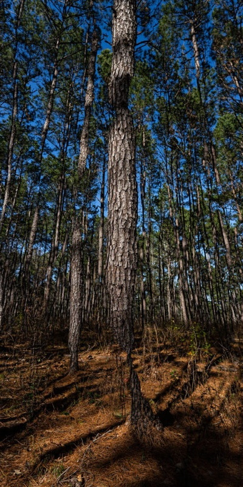
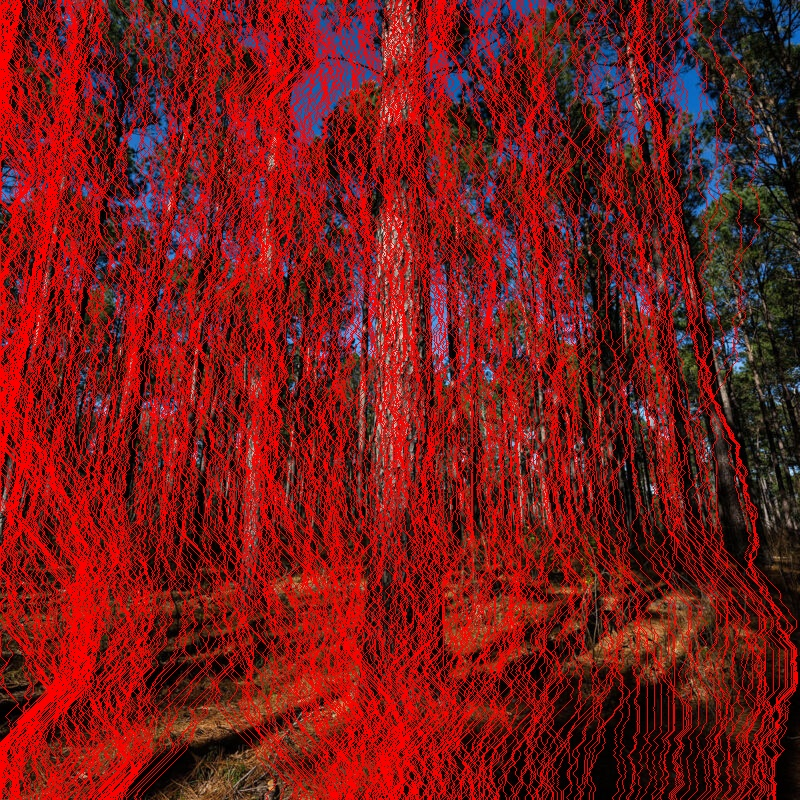

# Seam Carving for Image Resizing

This repository contains two implementations of the **Seam Carving** algorithm for content-aware image resizing:

1. **Seam Carving.py** - The standard implementation using dynamic programming.
2. **Seam Carving faster.py** - An optimized version with improved performance.

## Overview

Seam Carving is an image processing algorithm that intelligently resizes images by removing or inserting seams (paths of least importance). This method preserves important content while adapting the image size.

## Performance Comparison

| Implementation | Speed | Memory Usage |
|---------------|--------|--------------|
| Standard      | Slower | Moderate |
| Optimized    | Faster | Lower |

## Example Images

**Original Image:**  


**Resized Image:**  


**Seam Visualization:**  


## How to Run

1. Install required dependencies:
   ```bash
   pip install numpy opencv-python matplotlib
   ```
2. Run the script:
   ```bash
   python "Seam Carving.py" input.jpg output.jpg width height
   ```

For better performance, use the faster implementation:
   ```bash
   python "Seam Carving faster.py" input.jpg output.jpg width height
   ```

## Contributors

- **Mostafa Mohammed** - [GitHub Profile](https://github.com/your-profile)
- **Etahr Mohammed** -  [Github Profile](https://github.com/EtharAlshrqawy/EtharAlshrqawy)
- Special thanks to the research papers and references that helped in optimization.

## License

This project is licensed under the MIT License.
